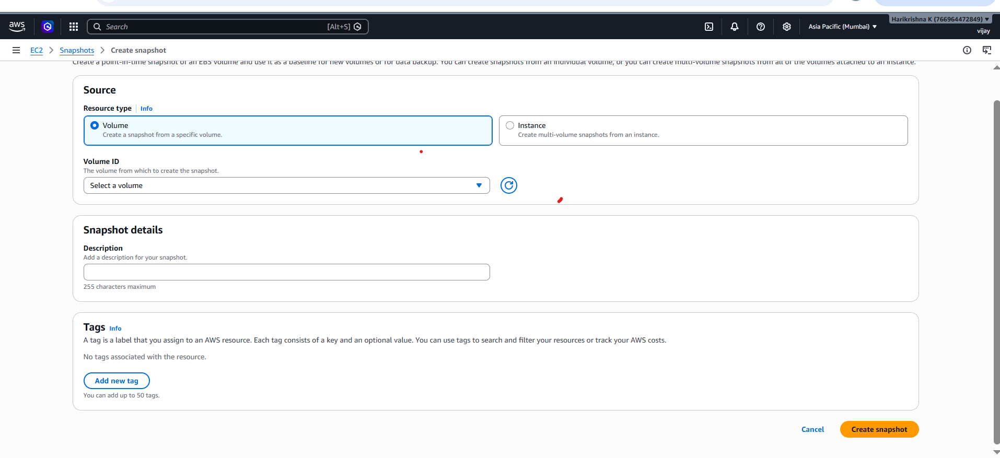
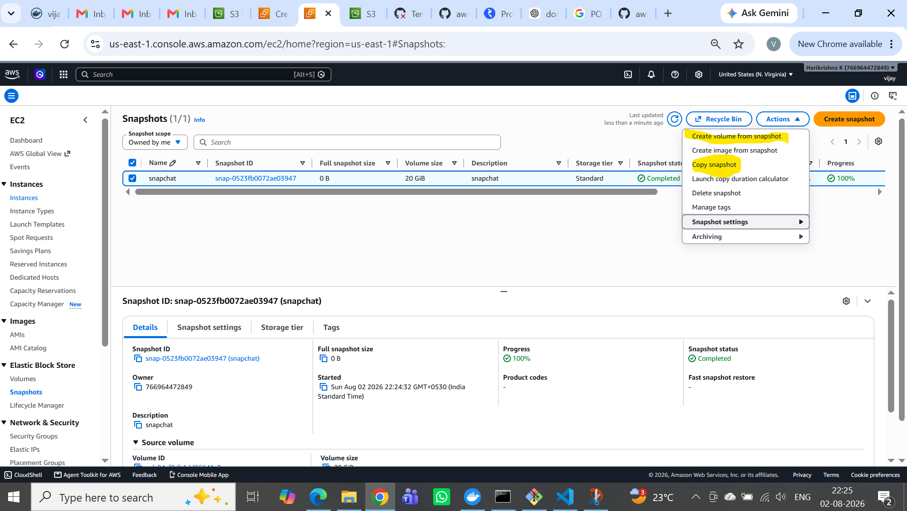
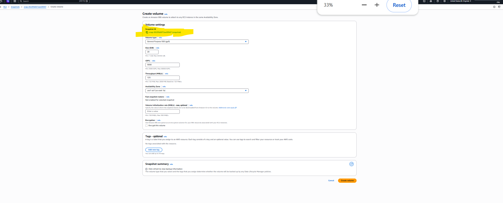

# Connection Errors

## Connection Timed Out

**Meaning:**

Traffic is being dropped before it reaches the application (often Security Group, NACL, or firewall).

---

## Connection Refused

**Meaning:**

The connection reached the server, but nothing is listening on that port (or the service actively rejected it).

---

# AWS Snapshot

An AWS Snapshot is a backup of an Amazon EBS (Elastic Block Store) volume.

It allows you to restore data or create new EBS volumes from the saved state.

## Purpose of the EBS

1. Backup
2. Migration

---

# 1. Backup

An EBS snapshot is a point-in-time backup of an EBS volume.

## Why do we take backups?

- Protect against accidental file deletion.
- Recover from application failures.
- Recover after OS corruption.
- Roll back before major changes (patching, deployments, upgrades).
- Disaster recovery.

---

## Example

Suppose you have an EC2 instance running Jenkins.

```text
EC2
│
├── Ubuntu
├── Jenkins
├── Docker
└── EBS Volume (100 GB)
```

Before upgrading Jenkins, you create a snapshot.

```text
EBS Volume
      │
Create Snapshot
      │
      ▼
Snapshot
```

If the upgrade fails:

```text
Snapshot
      │
Create New Volume
      │
Attach to EC2
      │
Restore Jenkins
```

The server returns to the state it was in when the snapshot was created.

---

## Interview Answer

> "We use EBS snapshots primarily for backup and disaster recovery. A snapshot captures the state of an EBS volume at a specific point in time. If data is lost, the volume becomes corrupted, or an upgrade fails, we can create a new EBS volume from the snapshot and restore the application."

---

# 2. Migration

Snapshots also help move data between Availability Zones or AWS Regions.

---

## A. Migration between Availability Zones

Suppose your EC2 instance is in:

```text
us-east-1a
```

and its EBS volume is also in:

```text
us-east-1a
```

You cannot directly attach that volume to an EC2 instance in:

```text
us-east-1b
```

because EBS volumes are AZ-specific.

### Solution

```text
Volume (1a)
      │
Create Snapshot
      │
Snapshot
      │
Create Volume in 1b
      │
Attach to EC2 in 1b
```

Now your application runs in another Availability Zone.

---

### Real Example

Suppose:

- Original EC2 → us-east-1a
- Need high availability in us-east-1b

You:

1. Take a snapshot.
2. Create a new EBS volume in us-east-1b.
3. Launch or use an EC2 instance in us-east-1b.
4. Attach the new volume.

---

## B. Migration between Regions

Suppose your production server is in:

```text
us-east-1
```

Now your company wants to deploy in:

```text
ap-south-1 (Mumbai)
```

### Steps

```text
EBS Volume
      │
Snapshot
      │
Copy Snapshot
      │
Destination Region
      │
Create Volume
      │
Launch EC2
```

AWS provides a **Copy Snapshot** feature to copy snapshots across Regions.

Then:

- Create a new EBS volume.
- Attach it to an EC2 instance in the destination Region.

### Why do companies do this?

- Disaster recovery.
- Opening services in new geographic locations.
- Lower latency for users.
- Regulatory or compliance requirements.

---

# 3. Fast Server Cloning

Suppose your application server is already configured.

Instead of installing everything again:

```text
Old Volume
     │
Snapshot
     │
Create New Volume
     │
Attach to New EC2
```

You instantly get another server with the same data.

---

# 4. Testing

Suppose you're upgrading:

- Database
- Jenkins
- Kubernetes
- Operating System

Before upgrading:

```text
Take Snapshot
```

If something breaks:

```text
Restore from Snapshot
```

No need to rebuild the server from scratch.

---

# Interview Diagram

```text
EC2
 │
 ▼
EBS Volume
 │
 ├── Backup
 │       │
 │       ▼
 │   Restore Later
 │
 ├── AZ Migration
 │       │
 │       ▼
 │  New Volume in another AZ
 │
 └── Region Migration
         │
         ▼
  Copy Snapshot
         │
         ▼
  New Volume in another Region
```

---

# Interview Answer (2–3 Minutes)

> "An EBS snapshot is a point-in-time backup of an EBS volume. We primarily use snapshots for backup, disaster recovery, migration, and cloning. For backups, snapshots allow us to recover data if a volume is corrupted, deleted, or an upgrade fails by creating a new EBS volume from the snapshot. For migration, since EBS volumes are tied to a specific Availability Zone, we first create a snapshot, then create a new volume in the target Availability Zone and attach it to an EC2 instance. For Region migration, we copy the snapshot to the destination Region, create a new EBS volume there, and attach it to an EC2 instance. This approach is commonly used for disaster recovery, business expansion, and moving workloads closer to users."

---

# CREATIONG SNAPSHOT FROM EXISTING EBS



```text    
            1) provide the snapchat name
            2) description
            3) volume (from which ebs snapshot need to create)
            3) tags
```

---

# CREATING EBS FROM EXISTING SNAPSHOT



---

# CREATING EBS FROM EXISTING SNAPSHOT OR MOVING TO ANOTHER REGION



