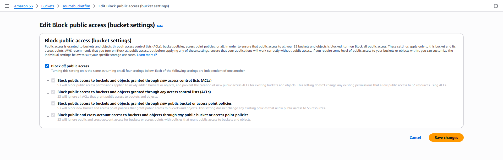

# creating s3 bucket

##### give bucket name 
##### give in which region it needs to create

# providing accees to the bucket
## disable public aceess before creating or after creting bucket

##### disable public aceess before creating or after creting bucket
