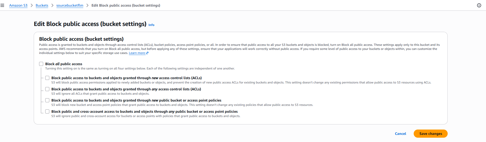
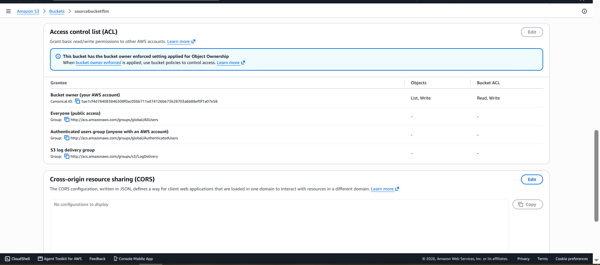
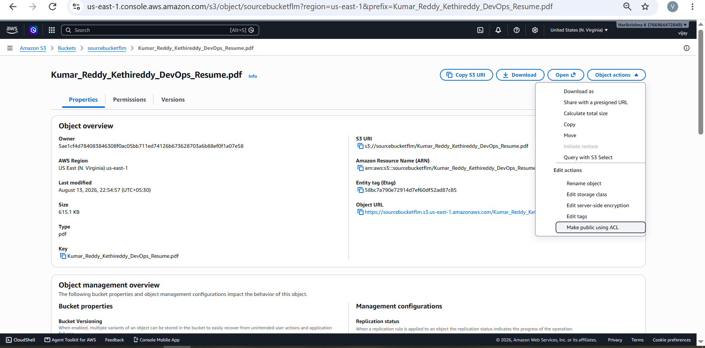
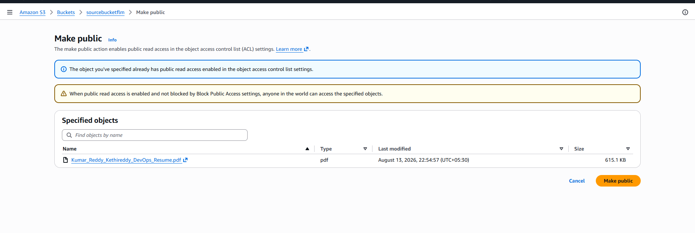

# 1) creating s3 bucket

##### give bucket name 
##### give in which region it needs to create

# in Permission 
## 2) providing public or accees  to the bucket to access form out side of s3
##### a) disable public aceess before creating or after creting bucket

##### b) disable public aceess before creating or after creting bucket

##### c) enable ACL in bucket
##### d) click owner enforced 

## 3) providing public or accees  to the bucket objects to access form outside of s3
##### a) click on object actions
##### b) click on make public using ACL

##### c) click on make public to make public

